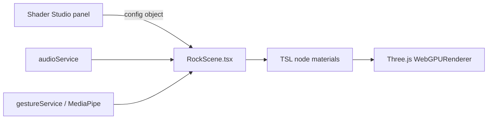

# Lithosphere

A browser app that renders a glowing orb with Three.js WebGPU shaders and lets you change every shader parameter live.

[](LICENSE)

**Live:** https://lithosphere.mustafasarac.com (needs a browser with WebGPU)
**Video:** [videos/lithosphere5.mp4](videos/lithosphere5.mp4)

## Why

It is a playground for Three.js TSL (Three Shading Language) node materials on the WebGPU renderer: one scene, many knobs, and a way to export what you end up with as JSON or TSL code.

## Quick start

Requires Node.js 20 (the version CI uses).

```bash
git clone https://github.com/neurabytelabs/lithosphere.git
cd lithosphere
npm ci
npm run dev      # http://localhost:3000
npm run build    # output in dist/
npm run preview  # serve the built dist/
```

### Browser requirement

The app needs WebGPU. Without it the app shows an error message and does not render the scene. Chrome and Edge 113 or later and Safari 18 or later expose WebGPU; only Chrome has been checked. See [caniuse.com/webgpu](https://caniuse.com/webgpu) for your browser.

## What it does

- Renders an inner glowing core and a transparent outer gel shell, using Three.js (r182) TSL node materials.
- Shader Studio panel: sliders and toggles for core, gel, lights, animation, shape, camera and post-processing (bloom, chromatic aberration, vignette).
- 10 built-in presets (`PRESETS` in `components/DebugPanel.tsx`), JSON import and export of the configuration, and TSL code export.
- Screenshot (PNG or JPEG) and WebM video capture, HDR environment maps, GLTF/GLB import.
- Multiple cores and gels, a simple N-body gravity mode, and a material demo scene ("Crystallum" mode).
- Audio reactivity from a file, the microphone or a browser tab, and hand-gesture camera control through the webcam (MediaPipe).
- Optional AI suggestions through the Gemini API (see below).

## How it works



The panel edits one configuration object; `components/RockScene.tsx` turns it into TSL node materials and renders them with the Three.js WebGPU renderer. Audio levels and hand gestures feed the same scene as extra inputs.

### AI suggestions (Gemini)

Both AI features call the Gemini API directly from the browser. The repo ships no API key; requests go only to `generativelanguage.googleapis.com`.

- **AI Studio** button (material suggestions): set your key in the browser console with `localStorage.setItem('lithosphere.geminiKey', '<your key>')`. Without a key it reports that it is unavailable.
- **AI tab in the Shader Studio panel**: paste your key into the "Gemini API Key" field; it is stored in `localStorage` under `gemini-api-key`.

### Layout

- `App.tsx`, `index.tsx`: app entry.
- `components/`: scene (`RockScene.tsx`), Shader Studio panel (`DebugPanel.tsx`), audio, gesture and material demo components.
- `materials/`, `src/`: material system, material picker and AI panel.
- `services/`: WebGPU check, physics presets, Gemini client, audio analysis, hand-gesture input.
- `CHANGELOG.md`: version history.

## Status / limits

- Prototype. It runs only in WebGPU browsers.
- No tests. The type check (`npx tsc --noEmit`) reports 6 errors; the Vite build still passes, and CI runs only the build.
- Frame rate has not been measured. The "60 FPS LOCKED" text in the header is a static label, not a measurement.
- The version in `version.ts` (7.0.0-alpha.1) and in `package.json` (6.0.0-alpha.1) disagree, and there are no git tags or releases.
- The demo video is about 35 MB.

## License

MIT. See [LICENSE](LICENSE). Third-party packages keep their own licenses.

Author: Mustafa Saraç, [mustafasarac.com](https://mustafasarac.com)
